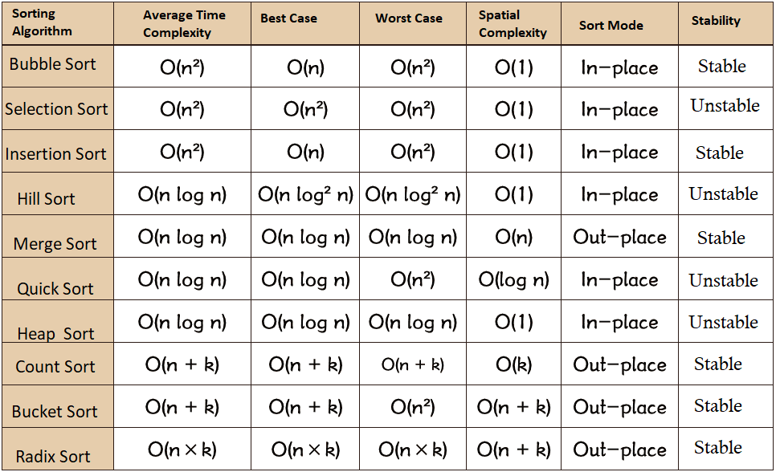

# Top 10 Classic Sorting Algorithms

The sorting algorithm is one of the most basic algorithms in Data Structures and Algorithms.

Sorting algorithms can be divided into internal sorting and external sorting. Internal sorting is the sorting of data records in memory, while external sorting is because the data to be sorted is large and cannot accommodate all sorting records at one time, and external memory needs to be accessed during the sorting process. Common internal sorting algorithms are: **insertion sort, Hill sort, selection sort, bubble sort, merge sort, quick sort, heap sort, radix sort** and so on. Summarize with a picture:

**About time complexity**:

1. Square order (O(n2)) sorting
Various simple sorts: direct insertion, direct selection, and bubble sort.
2. Linear logarithmic (O(nlog2n)) sorting
Quick sort, heap sort and merge sort;
3. O(n1+§)) ordering, where § is a constant between 0 and 1.
    Hill sort
4. Linear order (O(n)) sorting
Radix sort, in addition to bucket and bin sorting.

**About stability**:

Stable sorting algorithms: bubble sort, insertion sort, merge sort, and radix sort.

Not a stable sorting algorithm: selection sort, quick sort, hill sort, heap sort.

**Glossary**:

**n**: data size

**k**: the number of "buckets"

**In-place**: occupies constant memory, does not occupy additional memory

**Out-place**: takes up extra memory

**Stability**: 2 equal key values ​​are in the same order after sorting as they were before sorting

----

**GitBook Content Outline**

1. [Bubble Sort](1.bubbleSort.md)
2. [SelectionSort](2.selectionSort.md)
3. [Insertion Sort](3.insertionSort.md)
4. [Hill Sort](4.shellSort.md)
5. [Merge Sort](5.mergeSort.md)
6. [Quick Sort](6.quickSort.md)
7. [Heap Sort](7.heapSort.md)
8. [Counting Sort](8.countingSort.md)
9. [Bucket Sort](9.bucketSort.md)
10. [Radix Sort](10.radixSort.md)

----

The content of this book comes almost entirely from the Internet.

Open source project address: [https://github.com/hustcc/JS-Sorting-Algorithm](https://github.com/hustcc/JS-Sorting-Algorithm), organizer [hustcc](https://github .com/hustcc).

GitBook online reading address: [https://sort.hust.cc/](https://sort.hust.cc/).

This project uses [lint-md](https://github.com/hustcc/lint-md) to check the format of Chinese Markdown files. Make sure that the Markdown format is correct before submitting Pr.
